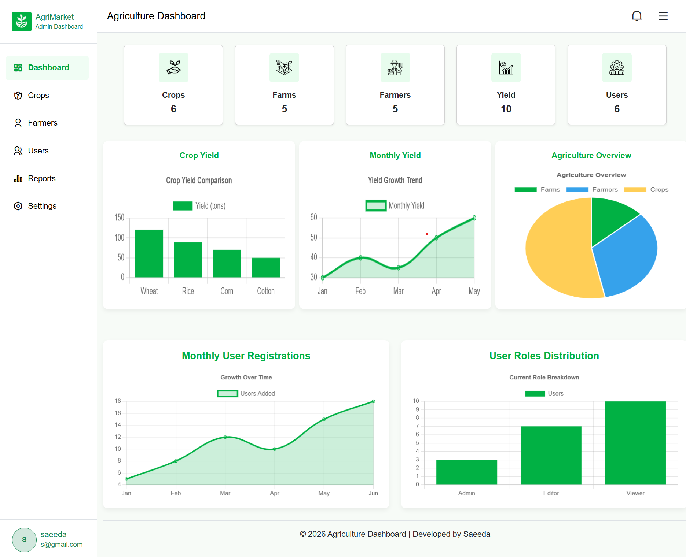
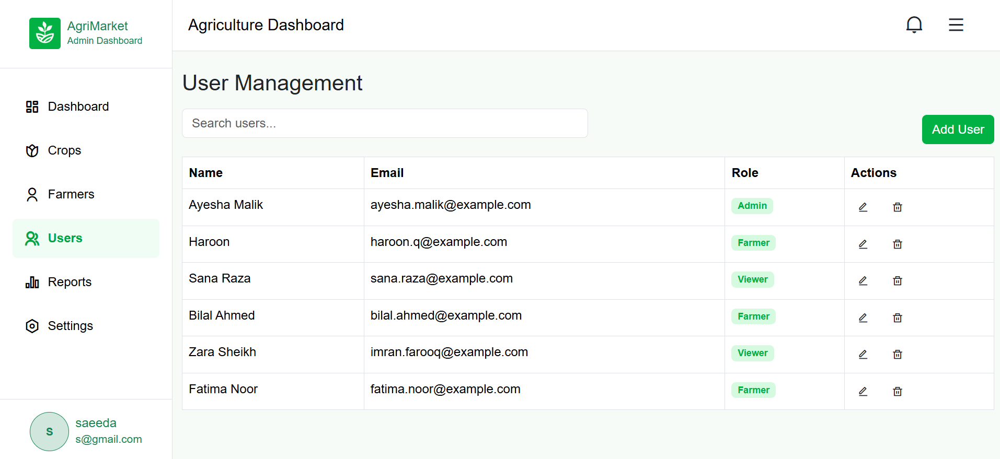
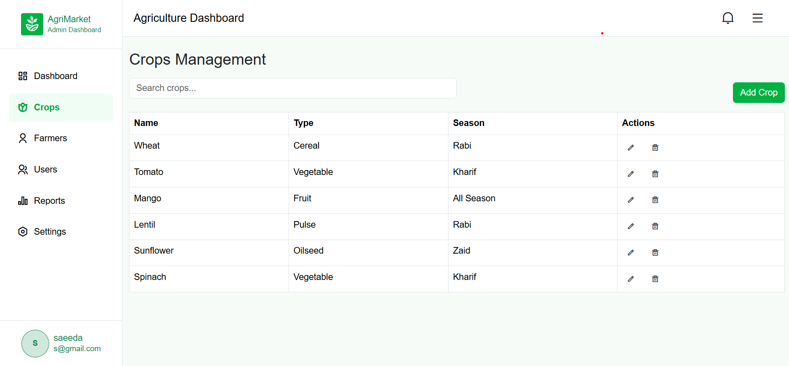
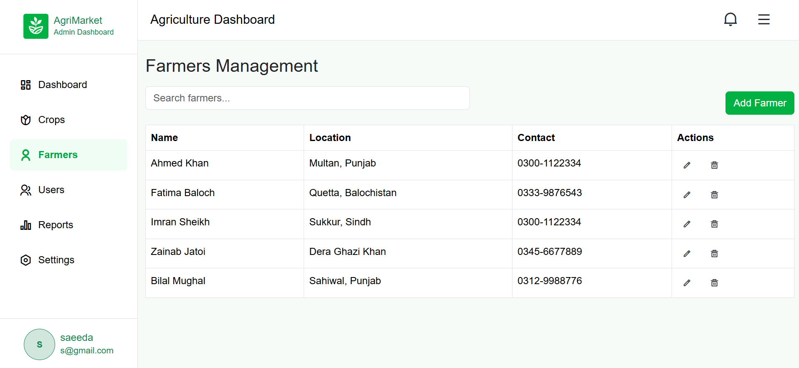
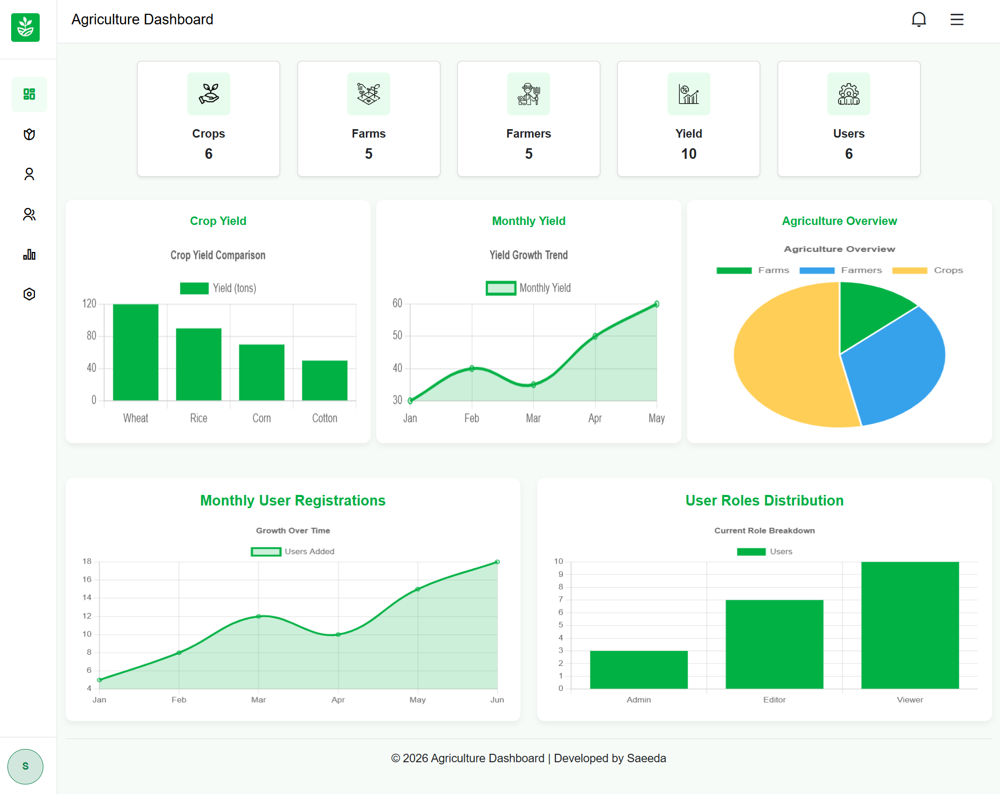
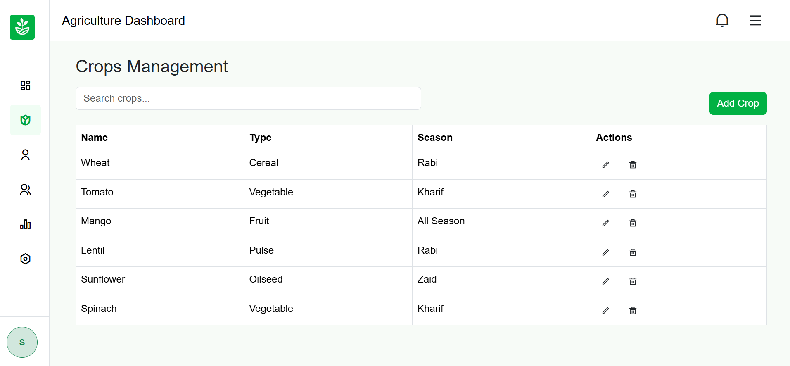
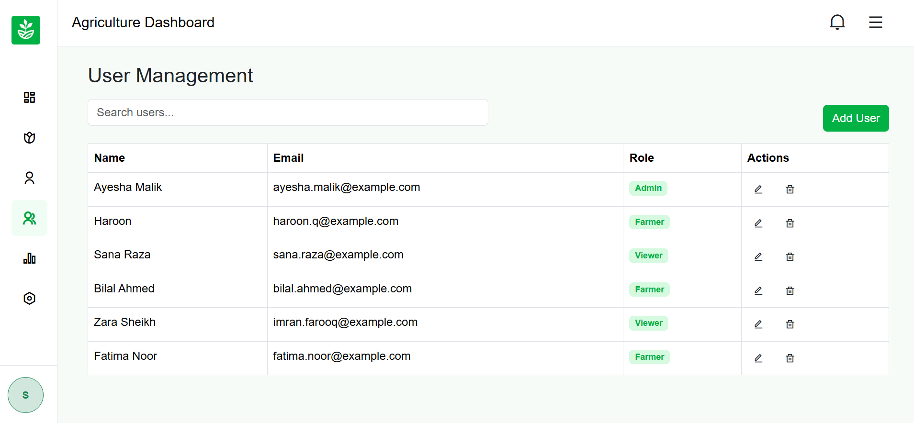

#  Agriculture Management Dashboard

##  Objective
The purpose of this project is to evaluate understanding of **core front-end development concepts** using **HTML, CSS, Bootstrap, and JavaScript*.


---

##  Application Idea
A **front-end only dashboard** for managing agricultural data:
- **Users Management** – Add, edit, delete users dynamically.
- **Crops Management** – Manage crop types and seasons.
- **Farmers Management** – Store farmer details.
- **Reports Section** – Generate and view agriculture-related reports.
- **Settings** – Placeholder for configuration options.

---

##  Layout Requirements
- **Navbar** with application title and dummy menu.
- **Sidebar** with navigation links: Dashboard, Users, Crops, Farmers, Reports, Settings.
- **Main Content Area** with tables and action buttons.
- **Footer** with copyright.

---

##  Modal Requirement
- Uses **Bootstrap modal** to add new users.
- Fields: **Name, Email, Role**.
- Input validation handled via **JavaScript**.
- Updates the table dynamically without page reload.

---

##  JavaScript Requirements
- Uses only **JavaScript concepts up to Objects**:
  - Variables
  - Functions
  - Events
  - Arrays
  - Objects
  - Loops
  - Conditions
  - DOM Manipulation

---

##  Project Structure

```
agriculture-dashboard/
│
├── index.html
├── crops.html
├── reports.html
├── settings.html
├── farmers.html
│
├── css/
│   └── style.css
│
├── js/
│   ├── charts.js
│   ├── crops.js
│   ├── farmers.js
│   ├── main.js
│   ├── reports.js
│   ├── settings.js
│   └── validation.js
│
│
└── images/         (images/icons later)

```


---

##  How to Run
1. Clone the repository:
      ```
   git clone https://github.com/your-username/agriculture-dashboard.git
      ```
3. Open index.html in your browser.
4.  Navigate through sidebar links to access Users, Crops, Farmers, Reports, Settings.
5. Use the Add User modal to dynamically add users. 


##  Technologies Used
- HTML5
- CSS3
- Bootstrap 5
- JavaScript (ES6 basics)

##  Features
- Responsive layout with Bootstrap 5.
- Sidebar toggle functionality.
- Dynamic tables for Users, Crops, Farmers, Reports.
- Add/Edit/Delete functionality using JavaScript.
- Search filters for quick lookup.
- Chart.js integration for crop yield visualization.

##  Screenshots

### Dashboard


### Users Management


### Crops Management


### Farmers Management



### Settings Page


##  Toggle Button Demo

<p align="center">
  
</p>

<p align="center">
    
  
</p>
